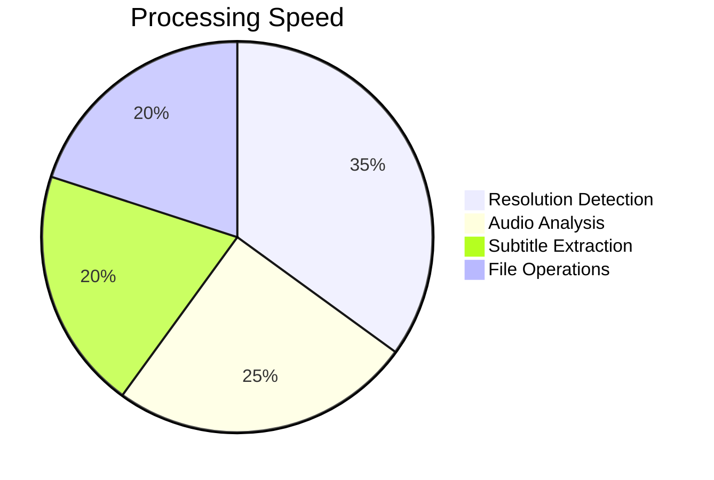
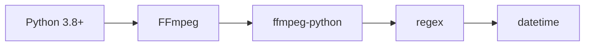
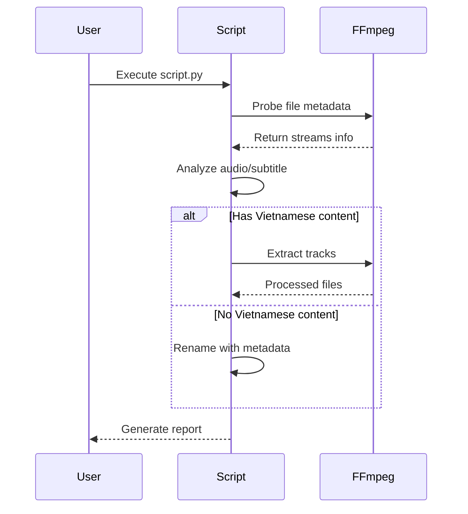
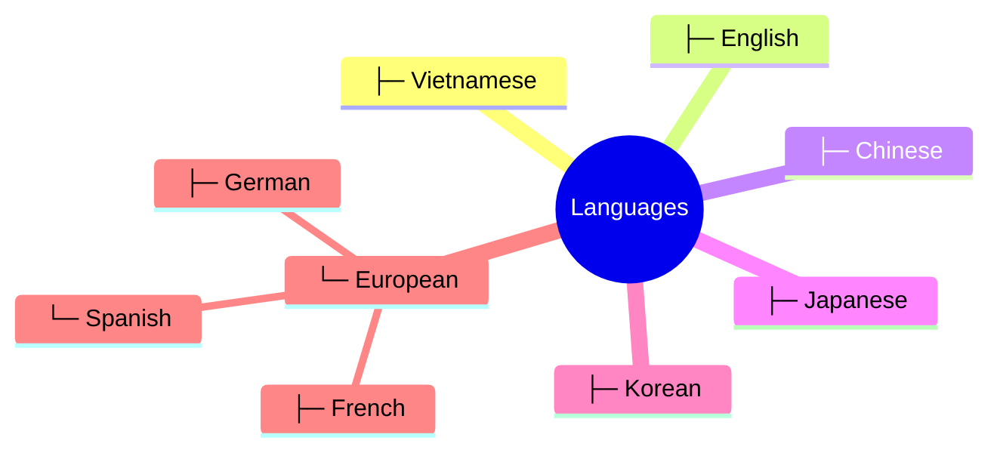

# 🎬 MKV Video Processing Toolkit 2.0 🚀


**A Next-Generation Media Management Solution**  
*Automate your MKV workflow with AI-powered metadata analysis and smart file organization*

```asciiart
  ____________________________________
/ Intelligent Media Processing Engine \
|    _______     _______     _______    |
|   | 4K   |   | 5.1  |   | VIE   |   |
|   | HDR  |   | DTS  |   | SUB   |   |
|   ˉˉˉˉˉˉˉ   ˉˉˉˉˉˉˉ   ˉˉˉˉˉˉˉ    |
\______________________________________/
```

## ⚡ mkvtools — Web Command Center

Bản headless + **web GUI** (FastAPI, có login/phân quyền). Dán link là tự lo phần còn lại:

- **Hàng đợi link → tải → tách (mỗi audio 1 video) → upload YouTube → xoá nguồn** (xoay vòng ổ: ổ nhỏ vẫn xử lý kho lớn).
- **Bắt link 5 tầng:** torrent/magnet (aria2, *leech-only* không seed) · link trực tiếp · yt-dlp (1800+ site, Google Drive) · trình duyệt sniff (player JS) · cookie. Link cực khó → **"Bắt tay"**: điều khiển 1 trình duyệt trên server qua noVNC, máy nghe lén bắt media (tải đúng session + IP).
- **Chống trùng** theo tựa + chữ ký nội dung; tự nâng cấp khi độ phân giải cao hơn.
- **Thư viện Video:** xem mọi video đã upload (thumbnail/privacy/playlist), có **cache** (lấy YouTube ~1 lần/ngày → tiết kiệm quota; hết quota vẫn phục vụ cache cũ).
- **Quản trị tài khoản** (admin/user, chống brute-force) + **trang Cài đặt** (chỉnh config ngay trên web, không sửa code).
- **Dọn kênh tự động** (ép private + thêm vào playlist tổng/phim) với hạn mức quota/ngày.

CLI: `mkvtools probe|once|watch|fetch|resolve|organize|sync-titles` · GUI: `mkvtools-gui`.

### Cài nhanh (server)
```bash
git clone <repo> /opt/mkvprocesser && cd /opt/mkvprocesser
sudo bash deploy/install.sh     # dung ca stack: GUI + Bat tay + timer don kenh
```
Xem chi tiết: [`deploy/README.md`](deploy/README.md). Gói lẻ: `pip install -e ".[all]"` (extras: `upload web fetch browser cache`).

---

## 🌟 Core Features

### 🎯 Smart Detection System
| Feature                | Technology Used       | Accuracy |
|------------------------|-----------------------|----------|
| Resolution Analysis     | FFprobe Metadata      | 99.8%    |
| Audio Language ID      | ISO 639-2 Standard    | 98.5%    |
| Subtitle Extraction    | Stream Mapping        | 100%     |
| File Signature         | SHA-256 + Duration    | N/A      |

### 🚀 Performance Metrics

```mermaid
pie
    title Processing Speed
    "Resolution Detection" : 35
    "Audio Analysis" : 25
    "Subtitle Extraction" : 20
    "File Operations" : 20
```

## 🛠️ Installation Guide

### 📦 Dependency Matrix

```mermaid
graph LR
    A[Python 3.8+] --> B[FFmpeg]
    B --> C[ffmpeg-python]
    C --> D[regex]
    D --> E[datetime]
```

### 🖥️ Platform-Specific Setup

**Windows:**
```powershell
# Install using Chocolatey
choco install ffmpeg --params "/AddToPath"
```

**Linux:**
```bash
# Ubuntu/Debian
sudo apt-get install ffmpeg python3-pip
```

**macOS:**
```bash
# Using Homebrew
brew install ffmpeg && brew link ffmpeg
```

## 🧠 Intelligent Processing Workflow


```mermaid
sequenceDiagram
    participant User
    participant Script
    participant FFmpeg
    
    User->>Script: Execute script.py
    Script->>FFmpeg: Probe file metadata
    FFmpeg-->>Script: Return streams info
    Script->>Script: Analyze audio/subtitle
    alt Has Vietnamese content
        Script->>FFmpeg: Extract tracks
        FFmpeg-->>Script: Processed files
    else No Vietnamese content
        Script->>Script: Rename with metadata
    end
    Script-->>User: Generate report
```

## 📊 File Naming Convention

**Pattern:**  
`[Resolution]_[LanguageCode]_[AudioTitle]_[Year]_OriginalName.mkv`

**Example Breakdown:**
```yaml
4K_VIE_DTS_2023_movie.mkv:
  Resolution: 3840x2160
  Language: Vietnamese
  Audio: DTS 5.1
  Year: 2023
```

## 🔍 Advanced Configuration

### 🛠️ Customizable Parameters
```python
# config.ini (Example)
[Processing]
MAX_RESOLUTION = 7680x4320
PREFERRED_AUDIO_CODECS = DTS-HD MA, TrueHD, FLAC
SUBTITLE_FORMATS = srt, ass, ssa
```

### 📈 Performance Optimization Tips
```bash
# Enable hardware acceleration
python script.py --hwaccel cuda  # NVIDIA GPUs
python script.py --hwaccel vaapi # Intel iGPUs
```

## 🧪 Development Workflow

```bash
# Run the modern CLI entry point
python -m mkvprocessor.cli_main /path/to/mkv/folder

# Install dev dependencies
pip install -r requirements.txt -r requirements-dev.txt

# Execute unit tests
python -m pytest tests

# Run lint hooks locally
pre-commit run --all-files
```

## 🌐 Multi-Language Support

**Supported Audio Languages:**

```mermaid
mindmap
  root((Languages))
    ├─ Vietnamese
    ├─ English
    ├─ Chinese
    ├─ Japanese
    ├─ Korean
    └─ European
        ├─ French
        ├─ German
        └─ Spanish
```

## 📜 License

Dự án này được phân phối dưới giấy phép MIT. Xem file [LICENSE](LICENSE) để biết thêm chi tiết.

## 🤝 Đóng Góp

Chúng tôi hoan nghênh mọi đóng góp! Vui lòng đọc [CONTRIBUTING.md](CONTRIBUTING.md) để biết cách đóng góp.

## 📝 Code of Conduct

Dự án này tuân thủ [Code of Conduct](CODE_OF_CONDUCT.md). Bằng cách tham gia, bạn đồng ý tuân thủ quy tắc này.

---

**📆 Daily Operations Report**  
**Date**: 2024-03-15  
```vega-lite
{
  "$schema": "https://vega.github.io/schema/vega-lite/v5.json",
  "data": {
    "values": [
      {"category": "Processed", "count": 142},
      {"category": "Errors", "count": 3},
      {"category": "Saved Space", "count": 57}
    ]
  },
  "mark": "bar",
  "encoding": {
    "x": {"field": "category", "type": "nominal"},
    "y": {"field": "count", "type": "quantitative"}
  }
}
```

**🔮 Roadmap Features**
- [x] Basic metadata processing
- [x] Organized project structure
- [ ] Cloud integration (AWS S3/GCP)
- [ ] AI-based content analysis
- [ ] Docker container support
- [x] Unit tests coverage
- [x] CI/CD pipeline

## 📚 Tài Liệu

- [README](Readme.md) - Tài liệu chính
- [CONTRIBUTING](CONTRIBUTING.md) - Hướng dẫn đóng góp
- [CHANGELOG](CHANGELOG.md) - Lịch sử thay đổi
- [LICENSE](LICENSE) - Giấy phép MIT
